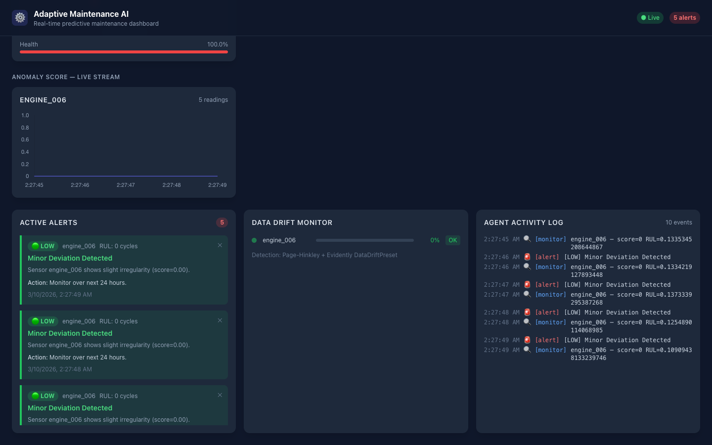
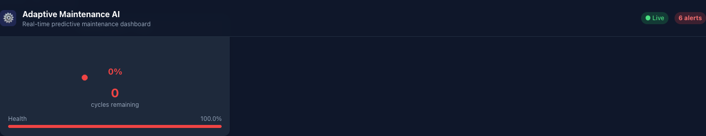
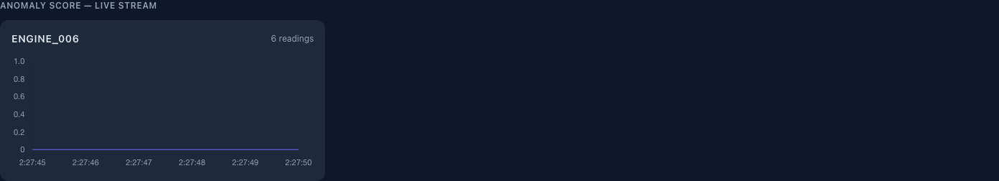
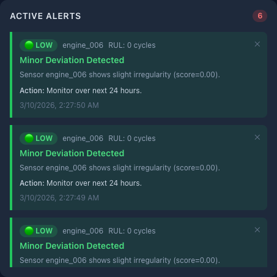
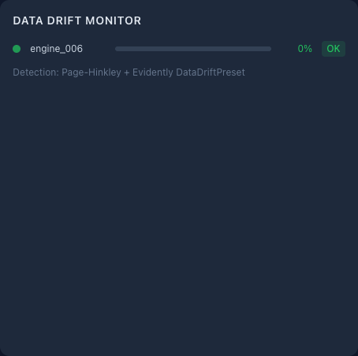

# Adaptive Maintenance AI

A production-grade, real-time predictive maintenance platform powered by a **LangGraph multi-agent system**, **LSTM-based RUL prediction**, and **statistical drift detection** — with a live React dashboard streaming data over WebSocket.

> **GitHub:** https://github.com/Likhith252002/adaptive-maintenance-ai

---

## Screenshots

### Live Dashboard

> Real-time sensor data from NASA CMAPSS turbofan engines streaming via WebSocket at 1 Hz.

### Sensor Health Chart

> Scrolling Chart.js line chart showing 14 normalised sensor readings per engine cycle.

### RUL Gauge

> SVG semi-circular gauge displaying Remaining Useful Life (0–125 cycles) per engine.

### Alert Panel

> Severity-sorted alerts (LOW / MEDIUM / HIGH / CRITICAL) generated by the AlertAgent. With an Anthropic API key, alerts are LLM-narrated by Claude.

### Drift Indicator

> Per-sensor drift status bars. Turns red when Page-Hinkley detects a distributional shift.

> **Add screenshots:** run the app locally, take screenshots of each panel, and save them to `docs/screenshots/`.

---

## Architecture

```
╔══════════════════════════════════════════════════════════════════════╗
║                    ADAPTIVE MAINTENANCE AI                           ║
╠══════════════════════════════════════════════════════════════════════╣
║                                                                      ║
║  ┌─────────────────────────────────────────────────────────────┐    ║
║  │               REACT FRONTEND  (Vite · port 5173)            │    ║
║  │                                                             │    ║
║  │  ┌───────────┐  ┌──────────┐  ┌───────────┐  ┌─────────┐  │    ║
║  │  │SensorChart│  │ RULGauge │  │AlertPanel │  │  Drift  │  │    ║
║  │  │ Chart.js  │  │SVG gauge │  │ severity  │  │Indicator│  │    ║
║  │  └───────────┘  └──────────┘  └───────────┘  └─────────┘  │    ║
║  │                  useWebSocket() hook                        │    ║
║  └──────────────────────┬──────────────────────────────────────┘    ║
║                         │  ws://localhost:5173/ws  (Vite proxy)     ║
║                         │  http://localhost:5173/api (REST proxy)   ║
╠═════════════════════════╪════════════════════════════════════════════╣
║                         ▼                                            ║
║  ┌──────────────────────────────────────────────────────────────┐   ║
║  │              FASTAPI BACKEND  (Uvicorn · port 8000)          │   ║
║  │                                                              │   ║
║  │  REST Endpoints          WebSocket Manager                   │   ║
║  │  GET /health             /ws  ──► broadcast()                │   ║
║  │  GET /api/v1/alerts             │                            │   ║
║  │  GET /api/v1/drift/status       │                            │   ║
║  │  POST /api/v1/retrain           │                            │   ║
║  │                                 │                            │   ║
║  │  ╔══════════════════════════════╪════════════════════════╗   │   ║
║  │  ║    LANGGRAPH ORCHESTRATOR    │  (StateGraph)          ║   │   ║
║  │  ║                              │                        ║   │   ║
║  │  ║  ┌────────────────┐          │                        ║   │   ║
║  │  ║  │ StreamSimulator│          │                        ║   │   ║
║  │  ║  │ NASA CMAPSS    │          │                        ║   │   ║
║  │  ║  │ FD001 (async)  │          │                        ║   │   ║
║  │  ║  └───────┬────────┘          │                        ║   │   ║
║  │  ║          │ SensorReading     │                        ║   │   ║
║  │  ║          ▼                   │                        ║   │   ║
║  │  ║  ┌───────────────┐           │                        ║   │   ║
║  │  ║  │  MonitorAgent │           │                        ║   │   ║
║  │  ║  │  · LSTM → RUL │           │                        ║   │   ║
║  │  ║  │  · IsoForest  │           │                        ║   │   ║
║  │  ║  │  · DriftDetect│           │                        ║   │   ║
║  │  ║  └──────┬────────┘           │                        ║   │   ║
║  │  ║         │ HealthMetrics ─────┘  (broadcast metrics)   ║   │   ║
║  │  ║         │                                             ║   │   ║
║  │  ║    ┌────┴──────────────────┐                          ║   │   ║
║  │  ║    │  conditional routing  │                          ║   │   ║
║  │  ║    └────┬─────────────┬────┘                          ║   │   ║
║  │  ║         │             │                               ║   │   ║
║  │  ║         ▼             ▼                               ║   │   ║
║  │  ║  ┌──────────┐  ┌─────────────────┐                   ║   │   ║
║  │  ║  │AlertAgent│  │RetrainingAgent  │                   ║   │   ║
║  │  ║  │· Claude  │  │· LSTM fine-tune │                   ║   │   ║
║  │  ║  │  (LLM)   │  │· on drift event │                   ║   │   ║
║  │  ║  │· rule-   │  └─────────────────┘                   ║   │   ║
║  │  ║  │  based   │                                         ║   │   ║
║  │  ║  └──────────┘                                         ║   │   ║
║  │  ╚═══════════════════════════════════════════════════════╝   │   ║
║  │                                                              │   ║
║  │  ┌──────────────────────┐  ┌──────────────────────────────┐ │   ║
║  │  │     ML MODELS        │  │      DRIFT DETECTION         │ │   ║
║  │  │  LSTMModel (PyTorch) │  │  Page-Hinkley  (per-sensor)  │ │   ║
║  │  │  seq_len=30, 14 feat │  │  Evidently DataDriftPreset   │ │   ║
║  │  │  IsolationForest     │  │  (batch reports)             │ │   ║
║  │  └──────────────────────┘  └──────────────────────────────┘ │   ║
║  └──────────────────────────────────────────────────────────────┘   ║
║                                                                      ║
║  DATA SOURCE: NASA CMAPSS FD001 — 100 engines · 20,631 train rows   ║
╚══════════════════════════════════════════════════════════════════════╝
```

---

## Tech Stack

| Layer | Technology |
|---|---|
| Frontend | React 18 · Vite · TailwindCSS · Chart.js |
| Backend | Python 3.11 · FastAPI · Uvicorn · WebSockets |
| ML | PyTorch (LSTM) · scikit-learn (IsolationForest) |
| Agents | LangGraph · LangChain · Claude (Anthropic) |
| Drift | Evidently · Page-Hinkley online test |
| Infra | Docker · Docker Compose |

---

## Project Structure

```
adaptive-maintenance-ai/
├── backend/
│   ├── agents/
│   │   ├── monitor_agent.py      # Sensor health + RUL estimation
│   │   ├── retraining_agent.py   # Adaptive fine-tuning on drift
│   │   ├── alert_agent.py        # LLM-generated maintenance alerts
│   │   └── orchestrator.py       # LangGraph state machine
│   ├── models/
│   │   ├── lstm_model.py         # Sequence-to-RUL LSTM
│   │   └── anomaly_detector.py   # IsolationForest wrapper
│   ├── data/
│   │   ├── data_loader.py        # NASA CMAPSS loader
│   │   └── stream_simulator.py   # Async sensor stream
│   ├── drift/
│   │   └── drift_detector.py     # PageHinkley + Evidently
│   ├── api/
│   │   ├── main.py               # FastAPI app + lifespan
│   │   ├── routes.py             # REST + WebSocket endpoints
│   │   └── websocket_manager.py  # Broadcast manager
│   ├── requirements.txt
│   └── Dockerfile
├── frontend/
│   ├── src/
│   │   ├── components/           # Dashboard UI components
│   │   ├── hooks/useWebSocket.js # Real-time data hook
│   │   ├── App.jsx               # Main dashboard layout
│   │   └── main.jsx
│   ├── package.json
│   ├── vite.config.js
│   └── Dockerfile
├── data/raw/                     # Place NASA CMAPSS files here
├── notebooks/exploration.ipynb
├── docker-compose.yml
├── .env.example
└── README.md
```

---

## Quick Start

### 1. Prerequisites
- Docker & Docker Compose
- (Optional) Anthropic API key for LLM-generated alerts

### 2. Clone & configure
```bash
git clone https://github.com/Likhith252002/adaptive-maintenance-ai.git
cd adaptive-maintenance-ai
cp .env.example .env
# Edit .env — add ANTHROPIC_API_KEY if desired
```

### 3. NASA CMAPSS dataset
The backend **automatically downloads** `train_FD001.txt`, `test_FD001.txt`, and `RUL_FD001.txt` from a GitHub mirror on first startup — no manual step required.

### 4. Run with Docker Compose
```bash
docker-compose up --build
```

| Service | URL |
|---|---|
| Frontend dashboard | http://localhost |
| Backend API docs | http://localhost:8000/docs |
| WebSocket | ws://localhost:8000/ws |

### 5. Run locally (dev mode)
```bash
# Backend
cd backend
python -m venv .venv && source .venv/bin/activate
pip install -r requirements.txt
uvicorn api.main:app --reload --port 8000

# Frontend (new terminal)
cd frontend
npm install
npm run dev
```

---

## Key Features

| Feature | Implementation |
|---|---|
| Real-time RUL prediction | Sliding-window LSTM (seq_len=30, 14 sensor features) |
| Anomaly detection | Isolation Forest with normalised [0,1] scoring |
| Multi-agent orchestration | LangGraph StateGraph with conditional routing |
| Adaptive retraining | Triggered automatically on drift detection |
| LLM-powered alerts | Claude generates context-aware maintenance messages |
| Data drift monitoring | Page-Hinkley online test + Evidently batch reports |
| Live dashboard | React + WebSocket streaming at 1 Hz |

---

## API Reference

| Endpoint | Method | Description |
|---|---|---|
| `/health` | GET | Service health check |
| `/api/v1/sensors` | GET | List active sensor IDs |
| `/api/v1/metrics/latest` | GET | Latest health metrics |
| `/api/v1/alerts` | GET | Recent alert history |
| `/api/v1/drift/status` | GET | Drift detection status |
| `/api/v1/retrain` | POST | Manually trigger retraining |
| `/ws` | WebSocket | Real-time event stream |

---

## Future Enhancements

- **MLflow** experiment tracking for retraining cycles
- **Redis** pub/sub for multi-instance WebSocket scaling
- **Prometheus + Grafana** observability stack
- **CI/CD** GitHub Actions pipeline with model validation gates
- **PostGIS** time-series storage for sensor history
